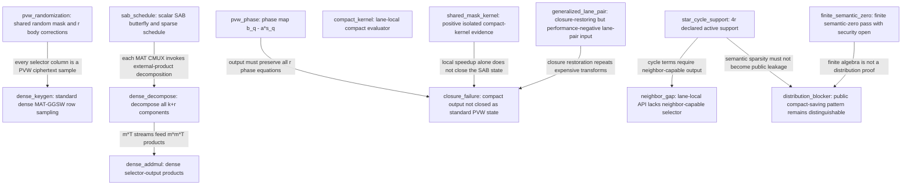

# 2025/686 MAT-SAB Selector And State Graph

## Campaign State

- Goal: `RESEARCH_CAMPAIGN_EXHAUSTED`
- Paper gate: `BLOCKED`
- Candidate A: `REJECTED`
- Candidate B: `REJECTED`
- Candidate C: `REJECTED` (active)
- Last decision: `REJECT_CANDIDATE_C_RANK_BOUNDED_STATE_CAMPAIGN_EXHAUSTED`
- Disposition: The finite A/B/C mechanism campaign is exhausted; Candidate C closed on its scoped C1 nonpositive structural-cost failure.

Task 3B and Task 4 were skipped; exact-dense PVW/MAT-SAB evidence is preserved; no Candidate D is opened automatically.



## Anchors

| node | path | status |
| --- | --- | --- |
| sab_schedule | `src/sparse_amortized_bootstrap.c` | PASS |
| pvw_phase | `src/mosfhet/src/pvwtmlwe.c` | PASS |
| pvw_randomization | `src/mosfhet/src/pvwtmlwe.c` | PASS |
| dense_keygen | `src/mosfhet/src/mattrgsw.c` | PASS |
| dense_decompose | `src/mosfhet/src/mattrgsw.c` | PASS |
| dense_addmul | `src/mosfhet/src/mattrgsw.c` | PASS |
| compact_kernel | `src/mosfhet/src/mattrgsw.c` | PASS |
| generalized_lane_pair | `repro/stage134_generalized_lane_pair_input_ep_gate/summary.csv` | PASS |
| shared_mask_kernel | `repro/stage138_shared_mask_compact_gate/summary.csv` | PASS |
| closure_failure | `repro/stage139_compact_closure_audit/summary.csv` | PASS |
| star_cycle_support | `repro/stage203_production_selector_equation_probe/equation_map.csv` | PASS |
| neighbor_gap | `repro/stage222_isolated_compact_ep_integration/expressiveness_results.csv` | PASS |
| distribution_blocker | `repro/stage249_structured_compact_distribution_security/claim_boundary.csv` | PASS |
| finite_semantic_zero | `repro/stage329_formal_compact_selector_checker/summary.csv` | PASS |

## Reproduction

```powershell
python scripts/build_mat_sab_selector_techgraph.py --input-commit 61b511feb39a261e3a404ee8108d7e6d05a5b1de
python -m unittest discover -s tests/research -p "test_*.py" -v
```
