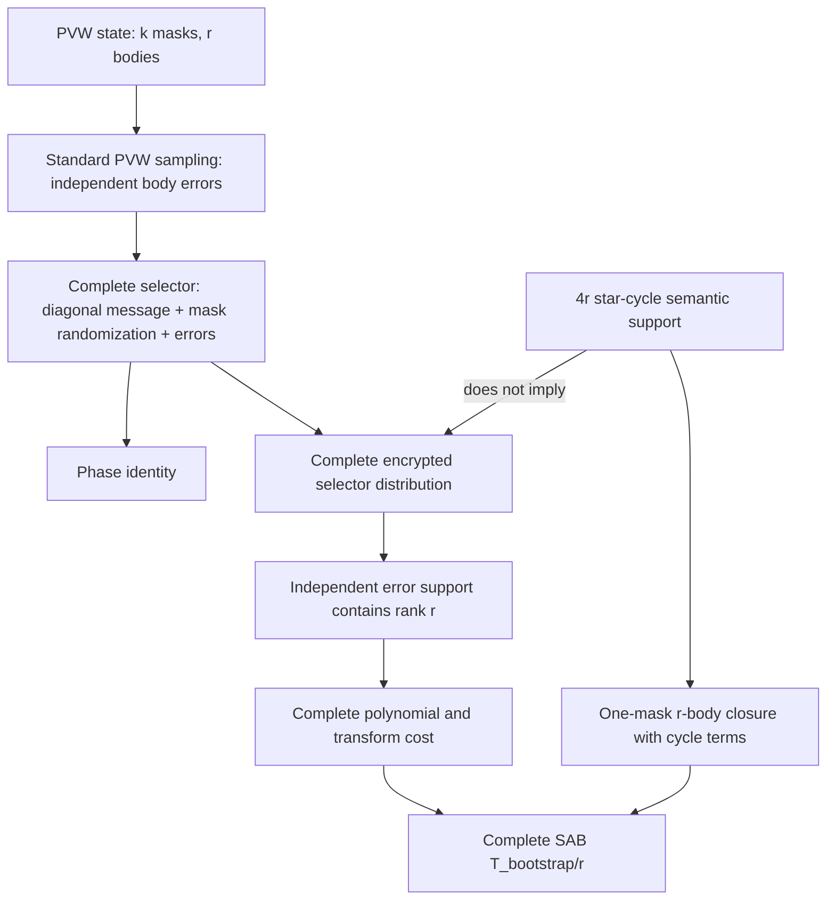

# Candidate B Factorized Selector Techgraph

## State

- Candidate A: `REJECTED` and narrowly frozen.
- Candidate B evidence is a historical pre-closeout INTAKE snapshot.
- Task 1 validation: `INTAKE -> TECHGRAPH_ANCHORED -> EQUATIONS_DEFINED` in memory.
- Repository state mutation: `false`.
- Production hot-path permission: `false`.

The in-memory progression records that the source graph and equation
obligations are ready for the executable gate. It does not pre-approve a
factorized mechanism and does not modify `research_state.yaml`.
Current campaign disposition is recorded elsewhere.

## Controlling Question

Can the complete standard-PVW MAT_TRGSW selector be represented and evaluated
with Theta(r) encrypted work, while preserving a closed one-mask, r-body
PVW accumulator and avoiding equivalent dense work in another primitive?

Semantic star-cycle support does not prove the complete encrypted selector distribution.



The semantic node describes which plaintext phase interactions the SAB
selector needs. The distribution node describes how those interactions are
hidden in independently randomized encrypted rows. Candidate B must satisfy
both nodes. Relabeling the four semantic families as four ciphertext objects
does not establish their component count, distribution, closure, or cost.

## Source Anchors

| Object | Path | Source token | Anchored conclusion |
| --- | --- | --- | --- |
| PVW ciphertext | `src/mosfhet/include/mosfhet.h` | `typedef struct _PVW_TMLWE{` | The state stores `k` masks and `r` bodies. |
| PVW sampling | `src/mosfhet/src/pvwtmlwe.c` | `void pvmtmlwe_sample(` | Sampling uses fresh mask and body-error material. |
| PVW phase | `src/mosfhet/src/pvwtmlwe.c` | `void pvmtmlwe_phase(` | The phase is `b - a S`. |
| Torus error coefficients | `src/mosfhet/src/misc.c` | `out[i] = double2torus(generate_normal_random(sigma));` | Every error coefficient is produced by the rounded normal sampler. |
| MAT selector sampling | `src/mosfhet/src/mattrgsw.c` | `void mat_trgsw_monomial_sample(` | Independently randomized PVW rows receive diagonal gadget terms. |
| Dense external product | `src/mosfhet/src/mattrgsw.c` | `void mat_trgsw_mul_pvmtmlwe_DFT(` | Every decomposed input coordinate feeds encrypted output coordinates. |
| PVW CMUX | `src/sab_pvw.c` | `void sab_pvw_CMUX(` | The external product is consumed by the SAB butterfly. |
| Default target | `main.c` | `return (SAB_PVW_Target_Params){2048, 1, 2048, 1, 1, 23, 3, 39, 7,` | The default target has `out_k=1` and `l=T=1`. |

## Algebra Path

Order a PVW coordinate vector as `(a_0,...,a_(k-1),b_0,...,b_(r-1))`.
With `m=k+r`, the complete one-level selector matrix is

```text
C = mu h I_(k+r) + V [I_k | S] + [0 | E].
```

For the target `k=1`, let `m=r+1`, `V=v`, and
`w^T=(1,s_0,...,s_(r-1))`:

```text
C = mu h I_m + v w^T + [0 | E].
```

For decomposed input digits `d`, mask randomization cancels under the phase
map:

```text
P(d^T C) = mu h P(d) + d^T E.
```

The noiseless `v w^T` term is rank one. For the complete error distribution,
explicit uniform-word pairs produce even and odd Torus errors. Use the ring
homomorphism `phi(f)=f(1) mod 2`. A supported parity-pattern error matrix maps
to `[I_r;0]`, while any inner-dimension-q ring
factorization maps to a field factorization of rank at most q. A complete
exact factorization must account for this support as well as the semantic
message action.

## Cost Path

At target `k=T=1`, the dense contraction exposes
`m^2=(r+1)^2` polynomial add-multiply terms. Theta(r) work in a generic dense
two-sided factorization requires `q=O(1)`, while the supported image witness
forces `q>=r`. A proposed factorization is
counted by polynomial components and operations, not by the number of
top-level ciphertext object names. The gate also counts decomposition, DFT,
conversion, relinearization, key switching, key bytes, and scratch.

Generic dense-factor counts are implementation counts, not universal
arithmetic lower bounds. A structured full-rank construction must be
registered and evaluated separately.

No endpoint claim is available until an admitted mechanism is measured as
complete `T_bootstrap/r` against repeated scalar SAB and exact-dense
PVW/MAT-SAB.

## Evidence Boundary

This Task 1 graph anchors the current implementation and the obligations for
the Candidate B checker. It does not prove a security reduction, noise
recurrence, factorized key construction, kernel speedup, complete-SAB speedup,
or paper novelty.
