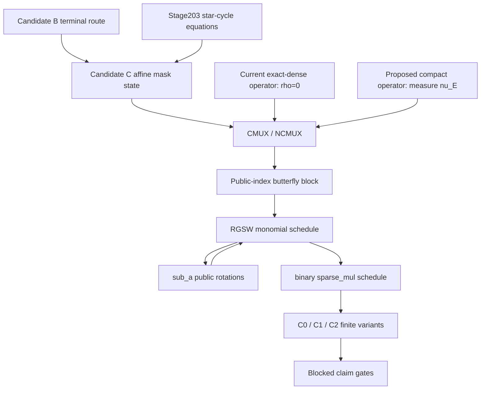

# Candidate C Rank-Bounded State Techgraph

## Scope

Candidate C is at `INTAKE`. Candidate B's terminal record routes the finite
campaign to the rank-bounded shared-mask state. This package does not mutate
`research_state.yaml` or any ledger.

Production hot-path permission: `false`.

The current state equations and schedule obligations are source anchored.

## State

For lane `q`, record

```text
a_q = a_shared + sum_(t=1..rho) lambda[q,t] delta_a[t]
phase_q = b_q - a_q s_q
rho = rank({a_q-a_0 : q=1,...,r-1})
lambda[0,t]=0
```

The `lambda` values are public. Choosing lane zero as the reference is a
normalization. The span of pairwise lane-mask differences is unchanged by
choosing another reference lane, so changing the reference lane does not
change `rho`.

## Source Graph



## Exact Anchors

| Object | Path | Exact token | Task 1 role |
| --- | --- | --- | --- |
| CMUX | `src/sab_pvw.c` | `void sab_pvw_CMUX(` | Forms the direct selected branch. |
| NCMUX | `src/sab_pvw.c` | `void sab_pvw_NCMUX(` | Applies the minus-one automorphism before CMUX. |
| Butterfly state | `src/sab_pvw.c` | `static uint64_t sab_pvw_RGSW_monomial_mul_state(` | Runs wrap NCMUX and direct CMUX edges for every bit. |
| Binary sparse multiplication | `src/sab_pvw.c` | `void sab_pvw_sparse_mul_binary(` | Repeats monomial then `sub_a`, then performs a final monomial. |
| Binary `sub_a` | `src/sab_pvw.c` | `static void sab_pvw_sub_a_binary_to(` | Applies one public monomial rotation per array index. |
| Rotation | `src/mosfhet/src/pvwtmlwe.c` | `void pvmtmlwe_mul_by_xai(` | Rotates every mask and body polynomial by the same public exponent. |
| Dense MAT external product | `src/mosfhet/src/mattrgsw.c` | `void mat_trgsw_mul_pvmtmlwe_DFT(` | Current exact-dense CMUX materialization primitive. |
| Default target | `main.c` | `return (SAB_PVW_Target_Params){2048, 1, 2048, 1, 1, 23, 3, 39, 7,` | Fixes `out_k=1`, `l=1`, and `N=2048`. |
| Candidate B terminal record | `repro/candidate_b_factorized_gate/summary.csv` | `REJECT_CANDIDATE_B_EXACT_STANDARD_PVW_FACTORIZATION_ROUTE_TO_C` | Fixes the predecessor route. |
| Stage203 equation map | `repro/stage203_production_selector_equation_probe/equation_map.csv` | `r,row,col,equation_class,semantic_role,is_public_row,may_skip_after_proof` | Fixes the four star-cycle semantic equation classes. |
| Stage345 baseline | `repro/stage345_binary_matrix_synthesis/summary.csv` | `PASS_STAGE345_BINARY_MATRIX_SYNTHESIS_SCOPED_READY` | Identifies the historical exact-dense baseline only. |

The Stage203 classes are
`mask_output_from_body_input`, `body_output_from_mask_input`,
`lane_self_body_interaction`, and
`lane_neighbor_body_interaction`. Their semantic map does not provide a
Candidate C key distribution or compact operator.

## Schedule Edges

The current CMUX source computes `in1 + selector*(in2-in1)`. Write its phase
obligation as

```text
phase'_q =
  phase1_q + mu (phase2_q-phase1_q) + epsilon_CMUX_q.
```

For a compact operator, `nu_CMUX` counts new lane-mask directions modulo the
two input difference spans:

```text
rho' <= min(r-1, rho1+rho2+nu_CMUX).
```

NCMUX first applies the scheduled minus-one automorphism `tau_-1`:

```text
phase'_q =
  phase1_q + mu (tau_-1(phase2_q)-phase1_q) + epsilon_NCMUX_q.
rho' <= min(r-1, rho1+rho2+nu_NCMUX).
```

At every public butterfly bit, wraparound outputs use NCMUX and direct outputs
use CMUX. The output of one bit feeds the next bit in
`sab_pvw_RGSW_monomial_mul_state`. A full RGSW monomial therefore requires a
rank trace after every butterfly bit, not only at its final output.

Binary `sub_a` calls `pvmtmlwe_mul_by_xai` for every public array index:

```text
phase'_(q,idx) = X^(a[idx]) phase_(q,idx)
rho'_(idx) <= rho_(idx).
```

The same linear monomial map is applied to `a_shared`, every `delta_a[t]`,
and every body while `lambda` remains unchanged. The real binary schedule is

```text
repeat [RGSW monomial, sub_a] h times, then RGSW monomial.
```

The current exact-dense PVW path returns one shared output mask and therefore
has `rho=0` at these edges. A proposed compact operator may introduce
lane-dependent mask directions; Task 1 names those directions but does not
assert a bound for them.

## Finite Variants

| ID | Exact name | Role | Required behavior |
| --- | --- | --- | --- |
| C0 | `independent_lane_directions` | Negative control | Expose `rho=r-1` when lane differences are independent. |
| C1 | `rank_two_basis_with_public_lambda` | Candidate | Maintain `rho<=2` through the schedule with no conversion. |
| C2 | `rank_two_basis_with_periodic_public_relinearization` | Candidate | Permit a registered conversion only after a public block of butterfly steps, never after every CMUX. |

There is no fourth Task 1 variant.

## Boundary

Task 1 does not establish that C1 closes or that the C2 conversion exists.
It records the equations that future finite checks must evaluate. Security,
noise, Amdahl, kernel, full-SAB, novelty, and production gates are all
`BLOCKED`.
